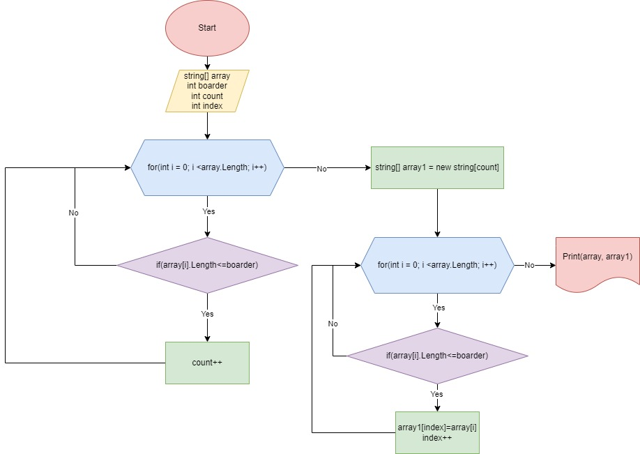

# Описание решения задачи
+ Создаем папку в VSCode
+ Переходим в папку и создаем консоль с помощью команды dotnet console
+ Доюавляем gitignore
+ В файле Programs.cs выполняем решение задачи на оснввании заданного условия. Создаем два метода в одном из которых находим длину нового массива с помощью цикла for, а во втором записываем слова из первого массива с длиной меньше либо равно 3-ем символам в новый массим.
+ Создаем два метода для вывода массива. В первом выводим первоначально заданный массив. Во втором выводим новый массив с проверкой на длину, если она равна нулю, то выводим скобки если не равна то выполняем обычный вывод с помощью цикла for.  
# Блок-схема решения задачи
**Решение задачи представлено на рисунке ниже**.

